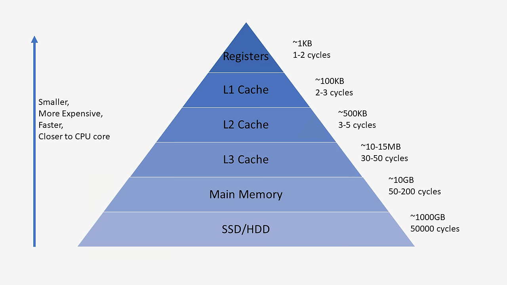
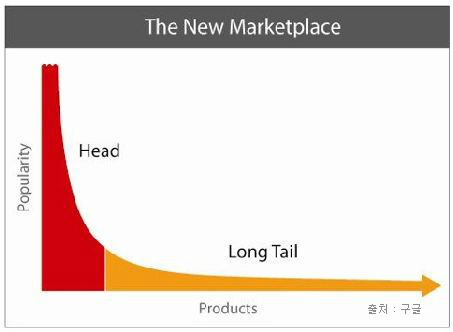
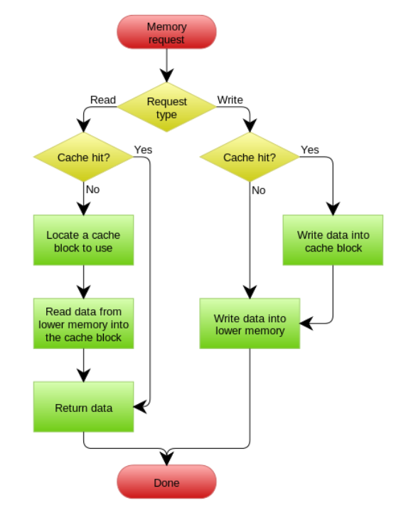

# 6주차 — Cache와 DB의 관계

**핵심 질문**

- DB를 안 쓰고도 서비스가 돌아가는 이유는?

**내용**

- Cache 위치별 분류
    - Local Cache
    - Redis
- Write-through / Write-back
- Cache Invalidation 지옥

**키워드**

`Redis`, `TTL`, `Consistency`

# Cache

- 자주 사용하는 데이터나 값을 미리 복사해 놓는 임시 장소
- 컴퓨터 시스템에서 속도가 빠른 장치와 느린 장치 사이의 속도 차이를 줄여주기 위해 사용
- 반복적으로 데이터를 불러올 때, 지속적으로 DBSM이나 서버에 요청하는 것이 아니라 Memory에 데이터를 저장했다가 불러다가 쓰는
- 저장 공간이 작고 비용이 비싼 대신 빠른 성능을 제공

예를 들어 **데이터베이스(DB)**가 도서관이라고 하면
책(데이터)이 정말 많지만 가지러 가는데 시간이 많이 걸림, 정보가 아주 많음
**캐시(Cache)**는 공간이 좁아서 책을 많이 두진 못하지만 자주 보는 책을 여기 놓으면 앉아서 바로 꺼내 볼 수 있는 책상이다

**캐싱(Caching)을 한다**는 것은, 도서관(DB)까지 매번 가지 않고 **자주 보는 책을 내 책상(Cache)에 복사해 두는 것**을 말

- Main Memory (RAM)
    - Local Cache와 Redis가 있음
    - 속도 매우 빠름
- SSD / HDD (Storage)
    - 영구 저장이 필요하기 때문에 데이터베이스(MySQL, Oracle 등)가 있음
- L1/L2/L3 Cache
    - 하드웨어 캐시
    - CPU가 RAM(메모리)에 있는 데이터를 빨리 읽기 위해 사용하는 저장소

사진 속 cycles(CPU가 작업을 처리하는 횟수)를 보면 DB에서 가져올 때 사이클이 훨씬 많음

단순히 물리적인 장치 속도만 비교해도 캐시(RAM)가 DB(Disk)보다 최소 250배 이상 빠름

### Cache Hit (캐시 적중)

**상황:** 요청한 데이터가 **이미 캐시에 존재**하는 경우

**동작:**

1. 애플리케이션이 캐시를 확인
2. 데이터가 있습니다! (Hit)
3. DB까지 가지 않고, 캐시에서 바로 데이터를 가져와 반환

### Cache Miss (캐시 놓침)

**상황:** 요청한 데이터가 **캐시에 없는** 경우

**동작:**

1. 애플리케이션이 캐시를 확인
2. 데이터가 없습니다. (Miss)
3. DB(디스크)에 가서 실제 데이터를 조회 (느림)
4. 조회한 데이터를 **다음에 쓸 수 있도록 캐시에 저장**
5. 데이터를 반환

**결과:** DB를 거쳐야 하므로 속도가 상대적으로 느리다

### Long Tail 법칙

20%의 요구가 시스템 리소스 대부분을 잡아먹는다는 법칙

→ 실제 서비스에서 자주 호출되는 20%의 리소스를 캐싱해서 리소스 사용량을 대폭 줄이고, 성능을 대폭 향상하게 

- **X축 (Products):** 데이터 종류
- **Y축 (Popularity):** 인기
- **Head:** 전체 데이터 중 아주 일부(상위 20%)지만 인기가 많아서 무조건 캐시에 넣어야
- **Long Tail:** 종류는 많지만 인기가 없어서 캐시에 넣으면 손해임
이 많은 데이터를 RAM에 다 넣을 수도 없고 넣어도 조회가 안되가지고 메모리만 낭비됨

## Local Cache (로컬 캐시)

- Local 장비 내에서만 사용됨
- 캐시 데이터가 애플리케이션 내부, 서버 컴퓨터 안에 있는 방식
- Local 장비의 Resource를 사용함 (Memory, Disk)
- Local 내에서만 사용하기 때문에 속도가 빠름

## Redis (Global Cache / Remote Cache)

- 여러 서버에서 공유하여 사용됨 = Global Cache (전역 캐시)
- 캐시 데이터가 별도의 외부 서버에 저장됨 = Remote Cache (원격 캐시)
- 별도의 서버 Resource를 사용함 → 웹 서버의 메모리를 쓰지 않으니 웹 서버가 바빠도 캐시는 영향을 덜 받음
- 네트워크 통신이 필요해서 로컬보다 상대적으로 느림

| **특징** | **Local Cache** | **Redis** |
| --- | --- | --- |
| **속도** | **가장 빠름** (메모리 직통) | 빠름 (네트워크 통신 필요) |
| **데이터 공유** | 불가능 (서버 간 데이터 다를 수 있음) | **가능** (모든 서버가 동일 데이터 봄) |
| **적합한 데이터** | 잘 바뀌지 않는 정보 (예: 공통 코드) | 자주 바뀌거나 공유해야 하는 정보 (예: 포인트, 재고) |

# 쓰기 전략

데이터가 변경(생성,수정…)될 때 캐시(Cache)와 데이터베이스(DB) 간의 싱크를 어떻게 맞출 것인가? 에 대한 규칙

데이터를 읽을 때는 캐시에 없으면 DB에서 가져오면 그만이지만 데이터를 쓸 때는(Write)

- 캐시에만 쓰고 DB에 안 쓰면? → 나중에 데이터가 사라질 수 있다
- DB에만 쓰고 캐시에 안 쓰면? → 다음 조회 때 느린 DB를 또 읽어야 한다

- **분기점:** Cache hit? (캐시에 데이터가 있는가?)
    - **Yes (오른쪽 화살표):**
        1. Write data into cache block (캐시에 먼저 씀)
        2. Write data into lower memory (메모리/DB에도 바로 씀)
        
        **해석:** 캐시와 하위 메모리(DB)에 **동시에(연속으로)** 쓰고 있는  **Write-through**
        
    - **No (왼쪽 화살표):**
        1. Write data into lower memory (바로 메모리/DB에만 씀)
        
        **해석:** 캐시에 없는 데이터는 굳이 캐시에 올리지 않고, 원본(DB)에만 바로 쓰는 **Write-around**
        

<aside>
💡

**안전성(Consistency)**과 **속도(Performance)** 중 무엇을 중요하게 생각하느냐?

</aside>

## Write-through

- 데이터를 쓸 때 **캐시와 DB 두 곳에 동시에** 쓰는 방식
- 데이터 저장 요청 → [캐시 저장] + [DB 저장] → 둘 다 완료되면 성공
- 장점: 캐시 일관성을 유지할 수 있어서 안정적
- 단점: 매번 느린 DB에 저장해야 하니까 쓰기 속도가 느림
- 주로 금융 데이터처럼 절대 틀리면 안 되는 중요한 데이터를 다룰 때 사용됨

## Write-around

- 데이터를 쓸 때 캐시는 건너뛰고(Around), **DB에만** 씀
- 쓰기 작업(저장, 수정, 삭제)을 캐시에는 반영하지 않고, DB에만 반영하는 방식
- 장점: 자주 읽히지 않는 데이터가 캐시에 쌓이지 않음
- 단점: 쓰기 직후 첫 Read는 반드시 Cache Miss 발생
    - Cache Miss: **요청한 데이터가 캐시에 없을 때** 발생하는 상황

## Write-back

- 데이터를 **캐시에만 먼저** 쓰고, DB에는 나중에 몰아서 쓰는 방식
- 데이터 저장 요청 → [캐시 저장] (빠름) → 일정 시간 뒤에 캐시 데이터를 모아서 [DB 저장]
- 장점: DB를 기다리지 않으니 쓰기 속도가 엄청 빠름
- 단점: DB에 옮기기 전에 캐시 서버가 죽으면 데이터가 영영 사라짐

## Write-miss

- 데이터를 수정하거나 새로 쓰려고 하는데, 캐시에 그 데이터가 없는 상황
- Write 요청 + Cache Miss

시스템이 어떻게 행동하느냐는 두 가지로 나뉨
→ 이 데이터를 캐시에 올릴까 말까?

1. **Write Allocate**
- Write-miss 발생 시
    1. **DB(또는 메모리)에서 데이터를 가져와**
    2. **캐시에 먼저 올림**
    3. 그 후 캐시에 Write 수행
    4. DB 반영은 정책에 따라 다름

- 주로 함께 쓰이는 정책
    - Write-back + Write Allocate
    - Write-through + Write Allocate

- 장점
    - 데이터를 저장할 때 캐시에도 미리 올려뒀기 때문에, 나중에 조회할 때 **느린 DB까지 가지 않고 빠른 캐시에서 바로 데이터를 찾을(Hit) 확률이 높다**
    - 한 번 써두면 이후 수십 번의 조회(Read)를 빠르게 처리할 수 있음

- 단점
    - Write만 하고 다시 안 읽는 데이터면 캐시 낭비
    - Write 비용 증가

1. **No-Write Allocate**
- Write-miss 발생 시
    - **캐시는 건드리지 않음**
    - 바로 **DB에만 Write**

- 주로 함께 쓰이는 정책
    - **Write-around**
    - 일부 Write-through 구현

- 장점
    - 캐시 오염 방지
    - Write 비용 감소

 

- 단점
    - Write 직후 Read 시 **Cache Miss 발생**
    - Read 성능 손해

# Cache Invalidation (캐시 무효화)

- 본 데이터(DB)가 변경되었을 때, 캐시에 있는 복사본 데이터를 삭제하거나 '만료됨'으로 표시하는 작업
- 수정하는 것이 아니라 삭제하는 것
- 캐시는 정합성보다 속도가 목적이라 복잡하게 “부분 수정”을 하느니 버리고 다시 만드는 게 안전함

무효화가 지옥인 이유는?

- 캐시는 원본이 아님
- 의존성이 많음
- 대부분은 정상처럼 보임
- **일부 케이스에서만 터짐**

→ 대부분 잘 동작하지만 발견, 재현이 어렵

### TTL(Time To Live)

- 캐시 무효화 로직이 실패했을 때를 대비한 최후의 안전장치
- 캐시 데이터의 자동 폭파 시간 (유통기한)

- TTL 만료 → 캐시 데이터 자동 삭제
- 강한 정합성은 포기하지만 대신 단순하고 안전함