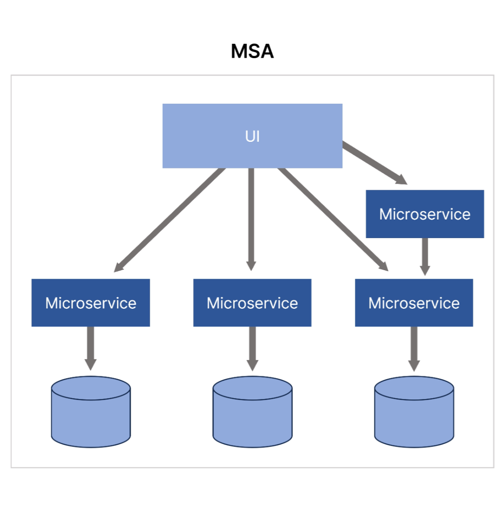

# 우아한형제들: 배달서비스 장애 감지 및 차단 시스템 분석

[https://www.youtube.com/watch?v=NKbmLyWlVpg](https://www.youtube.com/watch?v=NKbmLyWlVpg)

### 배달의 민족

- 대한민국 대표 배달 플랫폼
- 주문·배차·배달 상태 등 방대한 실시간 데이터를 처리하는 국내 최대 규모의 푸드테크 서비스
- 전국 수십만 사장님과 라이더, 그리고 수천만 고객의 실시간 인터랙션을 데이터로 연결함
- 최신 IT 기술을 실무에 적극 도입하여 배달 경험의 품질을 지속적으로 혁신하고 있음

### 주제 선정

- **분석 대상:** 우아한형제들 '**딜리버리 프로세싱 팀**'의 장애 대응 시스템
    - **팀의 역할:** 고객의 주문부터 라이더 배차, 최종 배달 완료까지의 전 과정을 데이터로 관리하며, 실시간으로 발생하는 방대한 배달 상태 값을 처리함
        - 배달 가능 지역 관리
        - 배달 데이터 생성
        - 배달상태 관리/변경
        - 배달상황 판단을 위한 지표
        - 주문 유입 조절
        
        
        
    - **시스템 특성:** 배달 데이터 생성 및 상태 변경이 중단될 경우, 고객이 음식을 받지 못하는 치명적인 서비스 장애로 직결되는 시스템임
- 전체 구조 추정
    - MSA 구조: 여러 개의 작은 서비스로 구성되어 각 서비스가 독립적으로 개발되고 배포되는 구조
        - 각각 독립적으로 되어 있으니 하나가 죽어도 전체가 살아있을 수 있음
        → 한 서비스가 죽어도 전체가 멈추지 않음
        - 하지만 논리적으로는 전체가 연결되어있음
        - 배달 서비스는 **실시간 트래픽이 매우 많음** → 단일 모놀리식 서비스로 처리 불가
        
        모놀리식 구조였다면?
        
        - 하나의 코드베이스 + 하나의 DB
        - 단일 배포 단위
        - 장점: 트랜잭션 관리 쉬움, 배포 단순
        - 단점:
            - 규모 커지면 배포/확장 어려움
            - 한 부분 장애 시 전체 시스템 영향
        - 주문 서비스와 배달 배차 서비스가 하나의 애플리케이션 안에 있으면, 배달 처리 장애 발생 시 주문 전체가 막힘 → 고객 피해 발생
        
        
        
    - 다중 서버+다중 DB
    각 서비스는 자신만의 독립된 데이터베이스(DB)를 가짐 (예: 주문 DB, 배달 DB, 정산 DB 분리)

서비스 간 결합도를 낮추어 배포와 확장이 쉬워졌지만, 반대로 **"주문은 성공했는데 배달 데이터는 생성되지 않는"** 데이터 정합성 문제가 발생할 위험이 있음

→ 분산 트랜잭션 문제

1. 주문 DB commit 성공
2. 네트워크 오류 발생
3. 배달 DB insert 실패

       → 롤백 불가

분산 트랜잭션: 2개 이상의 네트워크 상의 시스템 간의 트랜잭션

- **MSA의 구조적 난제:**
    - 기존 모놀리식 환경에서는 하나의 DB에서 COMMIT과 ROLLBACK으로 데이터 무결성을 보장했음 (ACID)
    - 하지만 배달의민족처럼 서비스와 DB가 쪼개진 **MSA 환경**에서는, 주문 DB(Order)와 배달 DB(Delivery)가 물리적으로 나뉘어 있어 단일 트랜잭션으로 묶기가 어려움
- **이벤트 기반의 결과적 일관성:**
    - 이를 해결하기 위해 **Saga 패턴** 등을 활용하여, 앞 단계(주문)가 성공하면 이벤트를 발행해 다음 단계(배달 생성)를 비동기로 실행하는 방식을 사용합니다.
    - 이 과정에서 데이터가 실시간으로 딱 맞지 않는 시차가 발생하거나, 네트워크 이슈로 이벤트가 유실되어 데이터 불일치가 발생할 수 있음
- 안돈 시스템은 이러한 트랜잭션의 흐름을 실시간으로 감시하여, **정합성이 깨지는 비율이 급증**할 때 즉시 장애로 판단하고 시스템을 차단함
- 이벤트/메시징 구조
    - 배달의민족 같은 대규모 서비스는 서비스들이 서로 직접 함수 호출하지 않음
    - 한 서비스가 느려지거나 장애 나면 전체 트랜잭션 지연 → 전체 서비스에 영향
    - 중간에 보통 **Apache Kafka** 같은 메시지 브로커가 있음 → 복잡한 메시징 구조 해결
    **Apache Kafka:** 당 수백만 건의 데이터를 처리할 수 있는 높은 처리량과 낮은 지연 시간을 특징으로 하는 오픈소스 분산형 이벤트 스트리밍 플랫폼
    - 작동 방법 예시
        1. 주문 서비스 → "OrderCreated" 이벤트 발행
        2. 배달 서비스 → 그 이벤트를 구독하고 처리
        3. 배차 서비스 → "DeliveryCreated" 이벤트를 구독
        4. 상태 관리 서비스 → 다음 이벤트 구독
    - [Order Service] --(OrderCreated)--> [Kafka]
                                                                   ↓
                                                  [Delivery Service]
    - 이 구조는 완전 장애가 아니라 부분 장애가 나타남

**클라우드 클러스터 환경 (Cloud Cluster Environment)**

단일 서버가 아니라, **수많은 서버가 협력해서 서비스를 제공**하고, 필요에 따라 서버를 추가하거나 줄일 수 있는 구조

- 인프라 유연성 (Scalability)
    - 트래픽이 많을 때 서버를 늘리고, 적을 때 줄이는 **오토스케일링** 가능
    - 예: 점심시간에 주문 폭주 → 자동으로 서버 10대 → 20대로 증가
- 고가용성 (High Availability)
    - 서버나 데이터센터 하나가 고장 나도 서비스 전체는 계속 동작
    - 여러 가용 영역(AZ, Availability Zone)에 서버/DB 분산
- 관리 편의성
    - 컨테이너 기반(Kubernetes) 운영 → 서버 환경을 코드로 관리 가능
    - 수천 개 서버 로그를 일일이 확인할 필요 없이 **클러스터 전체 상태**를 모니터링

- 안돈 시스템 필요성
    - 서버 단위 상태보다 **전체 비즈니스 지표 기반 감시**
    - 부분 장애나 DB 정합성 문제도 즉시 감지 가능
    - 클라우드 + MSA + 이벤트 구조에서 필수적인 **실시간 선제 차단 시스템**

- 필요한 것
    - 빠른 이상상황 감지
    - 즉각 조치
    - 효율적인 커뮤니케이션

### 안돈 시스템(Andon System)

- 자동차 생산 라인(토요타)에서 결함이 발견되면 즉시 라인을 멈추는 시스템에서 착안했음
- IT 서비스에서는 시스템 이상 시 '일단 멈춤'을 실행하는 '두꺼비집' 역할을 함
장애 감지 → 주문 유입 차단
- 단일 요청 성공/실패가 아니라 전체 시스템의 실패 패턴을 감시

- 안돈 시스템을 적용하면 시스템이 이상상황을 감지, 조치, 공지하는 것을 한번에 할 수 있겠구나

[지표 수집]
            ↓
[이상 판단 알고리즘]
            ↓
┌─────────────┬─────────────┬─────────────┐
│ 주문 차단   │ 담당자 호출 │ 상황 공지   │
└─────────────┴─────────────┴─────────────┘

- 실시간 배달 건별로 적합/부적합 여부를 검사
    - 모든 배달 건의 프로세스 전환 성공 여부를 실시간 전수 검사하여 '부적합' 지표를 산출
    - 이 지표의 급증 지점을 통해 시스템 이상상황 감지
    
    
    
    - 근데 월드컵같은 이벤트 때문에 급증하는 것을 장애로 오해하면 안됨
    → 데이터의 증가 기울기와 가속도를 분석해 장애를 스스로 판단함
    
    
    
    - 실패 건수가 연속적으로 증가하고, 그 증가 속도가 빨라지면 이상상황
    - **핵심 기능:** 장애 감지 시 즉각적으로 주문 유입을 조절(STOP)하고, 담당자에게 자동 호출 및 상황을 공지하는 '두꺼비집' 역할을 수행함

- **선정 이유**
    - **이론과 실무의 연결:** 단순한 DB 설계를 넘어, 대규모 트래픽 환경에서 발생하는 예기치 못한 장애를 시스템 아키텍처적으로 어떻게 격리하고 제어하는지 배우기 위함
    - **대응 효율의 극대화:** 사람이 개입하여 인지하고 조치하던 기존 방식(약 50분 소요)을 자동화 시스템을 통해 **1분 이내**로 단축한 실무적인 혁신 사례를 분석하고자 함
    - **고객 중심의 엔지니어링:** 기술적 완결성만큼이나 중요한 '고객 경험 보호'라는 본질적 가치를 위해 어떤 설계 결정을 내렸는지 심도 있게 고찰하기 위함임

### 핵심 분석: "왜 그렇게 설계했을까?"

- **기존 방식의 한계:** 장애 발생 시 인지 → 전파 → 판단 → 조치까지의 과정이 사람(담당자)에게 의존하여 평균 50분 이상의 긴 소요 시간 발생.
- **설계 목표:** 시스템이 이상 징후를 스스로 감지하고 '선조치(주무 유입 차단)'를 수행하여 고객 피해(배달 지연/취소)를 최소화함.
- **판단 알고리즘:** 단순 수치 비교가 아닌, 데이터의 기울기(가속도)를 분석하여 이벤트(월드컵 등)와 실제 장애를 구분하는 정교한 설계 도입